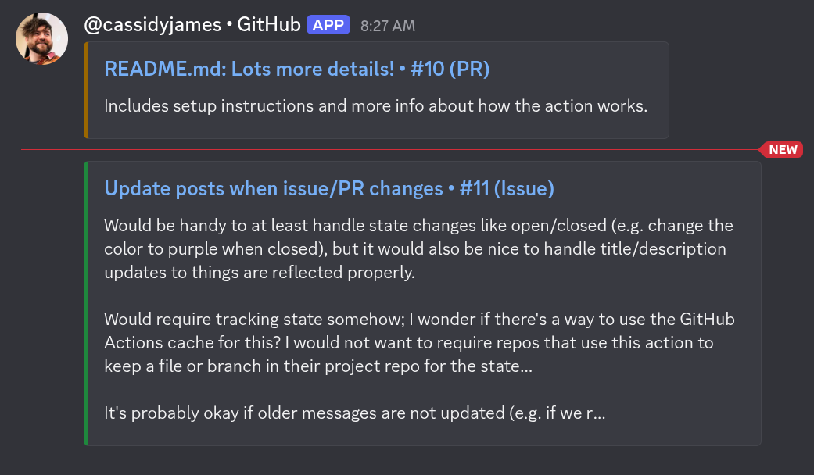

# discord-bot

Simple “bot” powered by GitHub Actions to send low-volume Discord messages when notable things happen on your GitHub repo.



Posts to a Discord channel when:

- An issue is opened
- A pull request is opened (or marked ready for review)
- A release is published

Filters out bots. Uses the GitHub user's username and avatar where possible for nice attribution/integration, especially when contributors use a similar identity across platforms.

> [!NOTE]
> **Why not native GitHub → Discord webhooks?**
> GitHub webhooks don't support the level of granularity we want; they're essentially all-or-nothing for different scopes. Instead, this Action focuses on the events worth sending a message about to a project channel, while still not requiring a extra infra. 

## Setup

**1. Create a webhook integration** in Discord for your project channel. The webhook's name and avatar may be used as a fallback. You can use [github.png](github.png) as the avatar, if you'd like.

**2. Add the webhook URL as a repository secret** for your project repo, named `DISCORD_WEBHOOK_URL`.

**3. Add the workflow** to your project repo, e.g. at `.github/workflows/discord.yml`:

```yaml
name: Discord

on:
  issues:
    types: [opened]
  pull_request_target:
    types: [opened, ready_for_review]
  release:
    types: [published]

permissions: {}

jobs:
  notify:
    runs-on: ubuntu-latest
    steps:
      - uses: roostorg/discord-bot@main
        with:
          webhook-url: ${{ secrets.DISCORD_WEBHOOK_URL }}
```

You can omit any triggers you don't want; e.g. `release` if you only care about issues and PRs.

## Security

This action uses `pull_request_target` so that the workflow running on PRs from forks can use the webhook secret; with plain `pull_request`, workflows running on fork PRs don't get secrets and the post would fail.

`pull_request_target` runs with access to your repo's secrets, so it's only safe because this workflow **never checks out or runs code from the PR** (and PRs always run the workflow from `main` so a malicious PR cannot expose secrets).

> [!CAUTION]
> **Do not add `actions/checkout` or other steps that run PR code to this workflow.** If you need those, put them in a separate workflow.

The workflow needs no GitHub token permissions; it only reads the event payload and posts to Discord.

## Known limitations

- **Posts aren't updated** when they change, e.g. when an issue or PR is closed, since that would require tracking state.

- **GitHub usernames containing "discord" or "clyde"** fall back to the webhook's default name, since Discord doesn't allow those words in webhook names.

## Development

Messages are crafted in [`message.jq`](message.jq) from the GitHub event payload. We target jq 1.6 since GitHub's runners don't always have the latest version.
